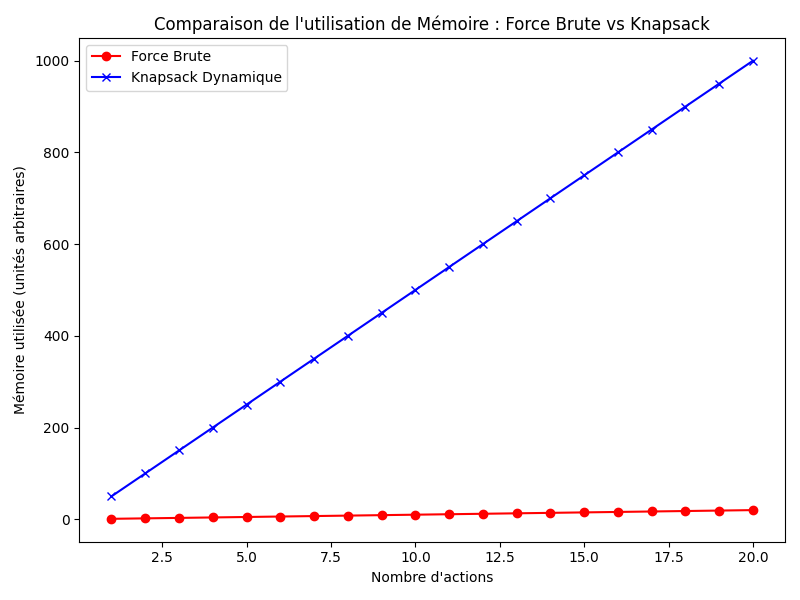
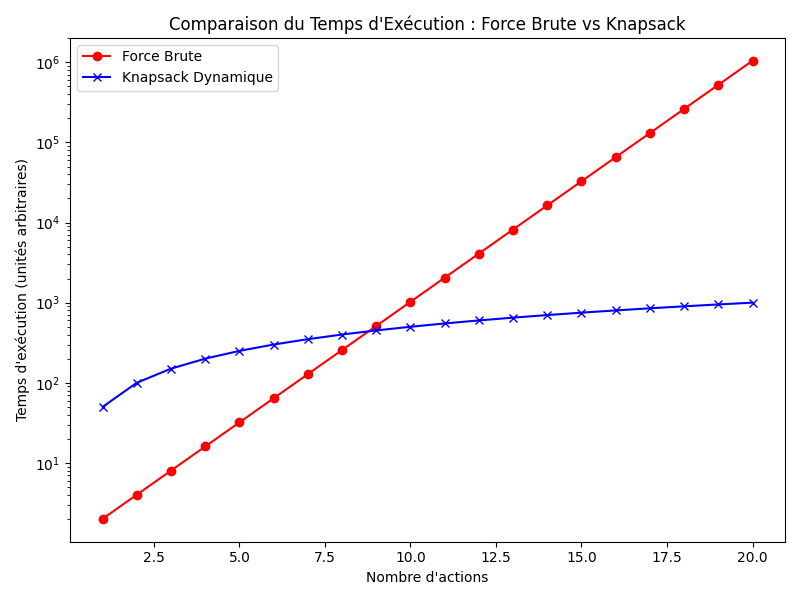

# Optimisation d'Investissement avec Force Brute et Algorithme du Sac à Dos (Knapsack)

## Description du projet

Ce projet vise à optimiser les investissements financiers en sélectionnant les actions qui maximisent le profit tout en respectant un budget prédéfini. Deux approches sont utilisées :
- **Force Brute** : L'algorithme teste toutes les combinaisons possibles d'actions pour trouver celle qui offre le meilleur profit.
- **Algorithme du Sac à Dos (Knapsack)** : Utilise une approche dynamique pour optimiser la sélection d'actions de manière plus efficace en termes de temps et de mémoire.

Les performances des deux algorithmes sont comparées à l'aide de jeux de données simulés.

## Installation et configuration

### Créer un environnement Python virtuel

Avant de commencer, il est recommandé de créer un **environnement virtuel Python** pour isoler les dépendances du projet.

1. Créez un environnement virtuel :
   ```bash
   python3 -m venv env
    ```

2. Activez l'environnement virtuel :
    - Sur Windows :
      ```bash
      env\Scripts\activate
      ```

    - Sur macOS et Linux :
      ```bash
      source env/bin/activate
      ```

3. Installez les dépendances du projet :
    ```bash
    pip install -r requirements.txt
    ```

## Contenu du projet

Le projet est composé des fichiers suivants :

- `bruteforce_test.py` : Implémentation de l'algorithme de force brute pour tester toutes les combinaisons d'actions possibles.
- `optimized_test.py` : Implémentation de l'algorithme Knapsack dynamique pour optimiser la sélection d'actions.
- `optimized_with_dataset.py` : Implémentation de l'algorithme Knapsack avec la possibilité de charger des datasets, les nettoyer et sauvegarder les résultats dans des fichiers CSV.
- `dataset1.csv` et `dataset2.csv` : Jeux de données utilisés pour tester les deux algorithmes.
- `resultats_dataset1_opti.csv` et `resultats_dataset2_opti.csv` : Résultats obtenus après optimisation avec l'algorithme Knapsack pour chaque dataset.
- `memory.png` et `tempo.png` : Graphiques comparant l'utilisation de la mémoire et le temps d'exécution des deux algorithmes (Force Brute vs Knapsack).

## Utilisation

### Exécution des tests avec force brute
Pour exécuter l'algorithme de force brute, utilise [bruteforce_test.py](./bruteforce_test.py) :

```bash
python3 bruteforce_test.py
```
L'algorithme calculera le profit maximal en testant toutes les combinaisons possibles d'actions tout en respectant le budget maximum défini dans le fichier.

### Exécution des tests avec l'algorithme Knapsack
Pour exécuter l'algorithme Knapsack avec un ensemble de données fixe, utilise [optimized_test.py](./optimized_test.py) :

```bash
python3 optimized_test.py
```
Cet algorithme appliquera une approche dynamique pour sélectionner les actions de manière optimale.

### Optimisation avec des jeux de données (datasets)
Pour tester l'algorithme Knapsack avec des datasets externes, utilise [optimized_with_dataset.py](./optimized_with_dataset.py) :

```bash
python3 optimized_with_dataset.py
```
Le script [optimized_with_dataset.py](./optimized_with_dataset.py) demandera de spécifier un budget et appliquera l'algorithme Knapsack sur les deux jeux de données ([dataset1.csv](./dataset1.csv) et [dataset2.csv](./dataset2.csv)). Les résultats seront sauvegardés dans des fichiers CSV.


## Résultats
Les résultats sont enregistrés sous forme de fichiers CSV :

- [resultats_dataset1_opti.csv](./resultats_dataset1_opti.csv)
- [resultats_dataset2_opti.csv](./resultats_dataset2_opti.csv)

Ces fichiers contiennent les actions sélectionnées, le coût total investi, le profit généré et le montant restant du budget.

## Comparaison des algorithmes
Deux graphiques sont fournis pour visualiser la comparaison entre force brute et Knapsack en termes de :

- Utilisation de la mémoire 
- Temps d'exécution 

Ces graphiques montrent que l'algorithme Knapsack est beaucoup plus efficace que l'approche par force brute lorsque le nombre d'actions augmente.
